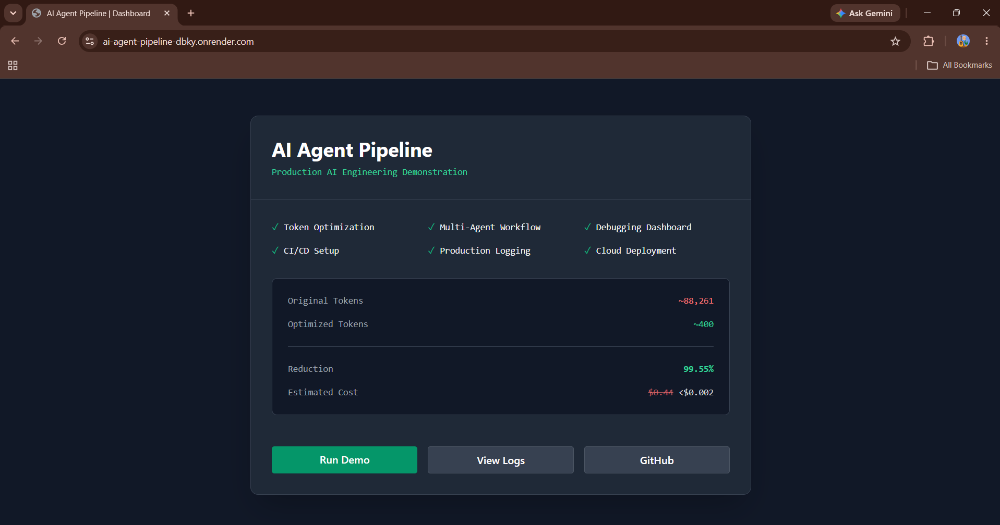
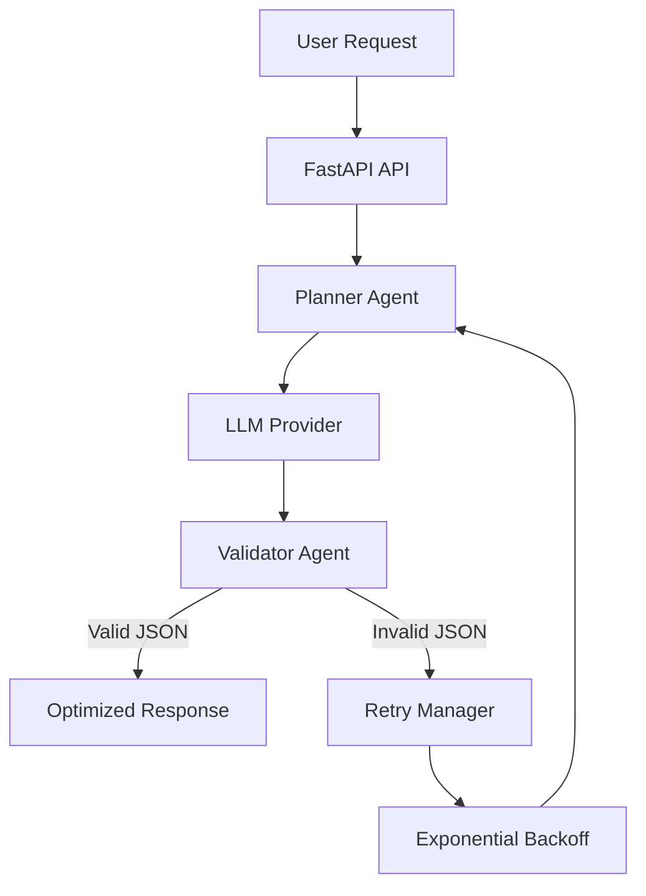
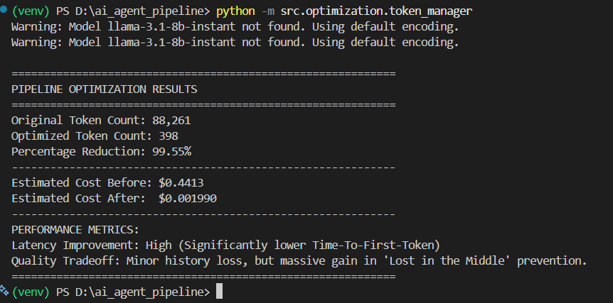

# 🚀 Fault-Tolerant AI Agent Pipeline

> A production-inspired multi-agent AI pipeline demonstrating **token optimization, autonomous error recovery, schema validation, and CI/CD deployment** using **FastAPI**, **GitHub Actions**, and modern LLM engineering practices.


---

# 🌐 Live Demo

**Dashboard**

https://ai-agent-pipeline-dbky.onrender.com/

**Swagger Documentation**

https://ai-agent-pipeline-dbky.onrender.com/docs

**GitHub Repository**

https://github.com/raoopriyanka/ai_agent_pipeline

---

# 📖 Overview

Large Language Model (LLM) applications often face several production challenges:

- Excessive prompt sizes leading to high API costs
- Increased inference latency
- Malformed or inconsistent model outputs
- Lack of automated validation and deployment workflows

This project demonstrates how these problems can be solved through a **fault-tolerant multi-agent architecture** emphasizing **cost efficiency**, **reliability**, and **production readiness**.

The pipeline includes:

- 🤖 Planner Agent
- ✅ Validator Agent
- 🔄 Automatic retry mechanism
- 📉 Token optimization
- ⚡ FastAPI REST API
- 🧪 Automated testing
- 🚀 GitHub Actions CI/CD

---

# 📸 Dashboard

The deployed FastAPI application provides a lightweight dashboard summarizing the pipeline capabilities and optimization metrics.

<p align="center">

</p>

---

# ✨ Features

## 🤖 AI Pipeline

- Multi-agent workflow
- Structured JSON generation
- Schema validation
- Automatic retry loop
- Production logging

## 📉 Token Optimization

- Top-K Retrieval Filtering
- Sliding Context Window
- Token counting utilities
- Context window management

## 🛡️ Reliability

- Malformed JSON detection
- Schema validation
- Automatic retries
- Exponential backoff
- Timeout handling
- Exception-safe execution

## 🚀 Deployment

- FastAPI REST API
- GitHub Actions CI
- Render deployment
- Automated testing
- Static analysis
- Code formatting

---

# 🏗️ Architecture



---

# 📂 Project Structure

```text
ai_agent_pipeline/
│
├── screenshots/
│   ├── dashboard.png
│   └── optimization-results.png
│
├── .github/
│   └── workflows/
│       └── main.yml
│
├── src/
│   ├── agents/
│   │   ├── planner.py
│   │   └── validator.py
│   │
│   ├── core/
│   │   ├── config.py
│   │   └── llm.py
│   │
│   ├── optimization/
│   │   ├── token_counter.py
│   │   ├── retrieval_filter.py
│   │   ├── context_window.py
│   │   └── token_manager.py
│   │
│   ├── utils/
│   │   ├── logger.py
│   │   └── tokenizer.py
│   │
│   └── main.py
│
├── tests/
│
├── requirements.txt
├── render.yaml
└── README.md
```

---

# ⚙️ Installation

## Clone Repository

```bash
git clone https://github.com/raoopriyanka/ai_agent_pipeline.git

cd ai_agent_pipeline
```

---

## Create Virtual Environment

### Windows

```powershell
python -m venv venv

.\venv\Scripts\activate
```

### Linux/macOS

```bash
python -m venv venv

source venv/bin/activate
```

---

## Install Dependencies

```bash
pip install -r requirements.txt
```

---

# 🔑 Environment Variables

Create a `.env` file.

```env
OPENAI_API_KEY=your_api_key

GROQ_API_KEY=your_api_key
```

---

# ▶️ Running the API

```bash
uvicorn src.main:app --reload
```

Open

```
http://127.0.0.1:8000/docs
```

for interactive Swagger documentation.

---

# 🧪 Running Tests

```bash
pytest tests -v
```

---

# 📉 Token Optimization Results

The optimization module combines **Top-K Retrieval Filtering** with **Sliding Context Windowing** to dramatically reduce unnecessary prompt tokens while preserving response quality.

| Metric | Before Optimization | After Optimization |
|---------|--------------------:|-------------------:|
| Prompt Tokens | **88,261** | **398** |
| Token Reduction | — | **99.55%** |
| Estimated API Cost | **$0.4413** | **$0.00199** |

## Benchmark Summary

- Prompt reduced from **88,261 → 398 tokens**
- **99.55%** token reduction
- Over **99% reduction** in estimated API cost
- Lower Time-To-First-Token (TTFT)
- Prevents context window overflow
- Reduces "Lost in the Middle" degradation
- Maintains response quality using retrieval filtering

---

# 📸 Optimization Benchmark

The benchmark below shows the optimization module executing against a representative workload.

<p align="center">

</p>

---

# 🛡️ Fault Tolerance

The pipeline automatically recovers from common LLM failures.

Supported scenarios include:

- Malformed JSON
- Missing schema fields
- Invalid response format
- Temporary API failures
- Request timeouts
- Rate limiting
- Retry with exponential backoff

## Recovery Flow

1. Planner Agent sends a request to the LLM.
2. Validator Agent checks schema compliance.
3. Invalid responses trigger automatic retries.
4. Exponential backoff delays retry attempts.
5. Valid structured output is returned.

---

# 🚀 Continuous Integration

Every push to the **main** branch automatically triggers GitHub Actions.

The workflow performs:

- Code formatting (Black)
- Linting (Flake8)
- Unit Testing (Pytest)
- Build Verification

This ensures every commit maintains production quality.

---

# 📦 Tech Stack

| Category | Technology |
|-----------|------------|
| Language | Python 3.11 |
| API | FastAPI |
| LLM | OpenAI / Groq |
| Validation | JSON Schema |
| Testing | Pytest |
| CI/CD | GitHub Actions |
| Formatting | Black |
| Linting | Flake8 |
| Logging | Python Logging |
| Deployment | Render |

---

# 📊 Performance Highlights

- **88,261 → 398 prompt tokens**
- **99.55% token reduction**
- **Over 99% cost savings**
- Automatic schema validation
- Self-healing retry mechanism
- FastAPI deployment
- GitHub Actions CI/CD
- Production-style logging
- REST API with Swagger UI

---

# 🔮 Future Improvements

- Async LLM requests using httpx
- Pydantic response models
- Docker containerization
- Redis prompt caching
- Prometheus metrics
- Grafana dashboards
- OpenTelemetry tracing
- LangGraph orchestration
- CrewAI integration
- Kubernetes deployment
- ELK Stack logging
- Datadog monitoring

---

# 🤝 Contributing

Contributions are welcome.

1. Fork the repository
2. Create a feature branch
3. Commit your changes
4. Open a Pull Request

---

# ⭐ Support

If you found this project useful, consider giving it a **⭐** on GitHub.