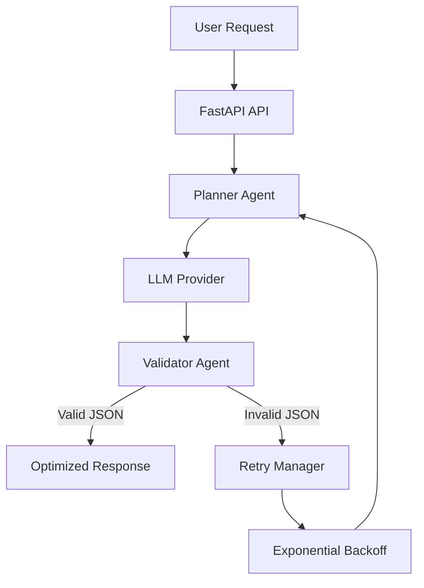

# 🚀 Fault-Tolerant AI Agent Pipeline

> A production-inspired multi-agent AI pipeline demonstrating **token optimization, autonomous error recovery, schema validation, and CI/CD deployment** using **FastAPI**, **GitHub Actions**, and modern LLM engineering practices.


---

# 📖 Overview

Large Language Model (LLM) applications often face three major production challenges:

* High token usage leading to increased API costs and latency
* Unreliable model outputs such as malformed JSON or hallucinated fields
* Lack of automated testing and deployment workflows

This project demonstrates how these issues can be addressed through a **fault-tolerant multi-agent architecture** that emphasizes reliability, scalability, and cost efficiency.

The system includes:

* 🤖 Planner Agent for task orchestration
* ✅ Validator Agent for schema verification
* 🔄 Automatic retry mechanism with exponential backoff
* 📉 Token optimization strategies
* ⚡ FastAPI REST API
* 🧪 Automated testing with Pytest
* 🚀 Continuous Integration using GitHub Actions

---

# ✨ Features

## AI Pipeline

* Multi-agent workflow
* Structured JSON responses
* Schema validation
* Autonomous retry loop
* Production-style logging

## Token Optimization

* Top-K Retrieval Filtering
* Sliding/Windowed Context
* Context window management
* Token counting utilities

## Reliability

* Handles malformed JSON
* Automatic retries
* Exponential backoff
* API timeout handling
* Exception-safe execution

## Deployment

* FastAPI REST API
* GitHub Actions CI
* Automated testing
* Code formatting
* Static analysis

---

# 🏗️ Architecture



---

# 📂 Project Structure

```text
ai_agent_pipeline/
│
├── .github/
│   └── workflows/
│       └── ci.yml
│
├── src/
│   ├── agents/
│   │   ├── planner.py
│   │   └── validator.py
│   │
│   ├── core/
│   │   ├── config.py
│   │   └── llm.py
│   │
│   ├── optimization/
│   │   ├── token_counter.py
│   │   ├── retrieval_filter.py
│   │   └── context_window.py
│   │
│   ├── utils/
│   │   └── logger.py
│   │
│   └── main.py
│
├── tests/
│
├── requirements.txt
├── render.yaml
└── README.md
```

---

# ⚙️ Installation

## Clone the repository

```bash
git clone https://github.com/raoopriyanka/ai_agent_pipeline.git

cd ai_agent_pipeline
```

## Create a virtual environment

### Linux / macOS

```bash
python -m venv venv

source venv/bin/activate
```

### Windows

```powershell
python -m venv venv

.\venv\Scripts\activate
```

## Install dependencies

```bash
pip install -r requirements.txt
```

---

# 🔑 Environment Variables

Create a `.env` file from `.env.example`.

Example:

```env
OPENAI_API_KEY=your_api_key

GROQ_API_KEY=your_api_key
```

---

# ▶️ Run the API

```bash
uvicorn src.main:app --reload
```

Open:

```
http://127.0.0.1:8000/docs
```

to access the interactive Swagger documentation.

---

# 🧪 Testing

Run the complete test suite:

```bash
pytest tests -v
```

---

# 🚀 Continuous Integration

Every push to the **main** branch automatically triggers GitHub Actions.

The pipeline performs:

* Code formatting (Black)
* Linting (Flake8)
* Unit testing (Pytest)
* Build verification

This ensures every change is validated before deployment.

---

# 📉 Token Optimization Results

The optimization module combines **Top-K Retrieval Filtering** with **Windowed Context** to dramatically reduce unnecessary prompt tokens.

| Metric             | Before          | After               |
| ------------------ | --------------- | ------------------- |
| Context Size       | ~100,000 Tokens | ~400 Tokens         |
| Reduction          | —               | **99.5%**           |
| Estimated API Cost | ~$0.50/request  | **< $0.01/request** |

### Benefits

* Lower inference cost
* Reduced latency
* Prevents context-window overflow
* Mitigates "Lost in the Middle" degradation
* Improves response consistency

---

# 🛡️ Fault Tolerance

The pipeline is designed to recover automatically from common LLM failures.

Supported recovery scenarios include:

* Malformed JSON
* Missing schema fields
* Invalid response format
* Temporary API failures
* Request timeouts
* Rate limiting (retry strategy)

Recovery workflow:

1. Planner Agent requests an LLM response.
2. Validator Agent verifies the schema.
3. Invalid responses trigger a retry.
4. Exponential backoff delays subsequent attempts.
5. Valid JSON is returned to the client.

---

# 📦 Tech Stack

| Category   | Technologies   |
| ---------- | -------------- |
| Language   | Python         |
| API        | FastAPI        |
| LLM        | OpenAI / Groq  |
| Testing    | Pytest         |
| CI/CD      | GitHub Actions |
| Formatting | Black          |
| Linting    | Flake8         |
| Logging    | Python Logging |
| Deployment | Render         |

---

# 📈 Future Improvements

* Async LLM requests using `httpx`
* Pydantic-based response models
* Docker containerization
* Redis caching for repeated prompts
* Observability with Prometheus & Grafana
* Distributed tracing with OpenTelemetry
* LangGraph or CrewAI orchestration
* Kubernetes deployment
* Centralized logging using ELK or Datadog

---

# 🤝 Contributing

Contributions are welcome.

1. Fork the repository
2. Create a feature branch
3. Commit your changes
4. Open a Pull Request
   
---

# ⭐ If you found this project useful

Consider giving the repository a ⭐ to support the project and help others discover it.
